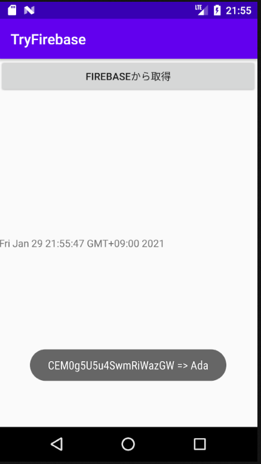

# TryFirebaseAndroidStudio

# DEMO
ボタンを押してCloud Firestoreから取得したデータがトーストに表示されるデモ画像です。

# Features
ほぼほぼCloud Firestoreに登録された情報を取得して表示するだけのアプリです。Hackthonなどでデータ登録できるAndroidアプリを開発する際などのひな形として作ってみました。よかった使ってみて下さい。

# Dependency
使用した言語、ツール、ライブラリ、デバイスは次の通りです。

- Java (openjdk 11.0.9.1)
- Firebase
- Android Studio (4.1.2)
- Qua phone(実機確認はこれでやりました)

# Build the repository
本リポジトリをもしご利用でしたら以下のコマンドをC:\Users\ユーザー名\AndroidStudioProjectsでcmdやGitBashなどを開いて実行してください。

git clone https://github.com/anoiro/TryFirebaseAndroidStudio.git

その後、Android Studioを開いてツールバーのFile -> OpenでC:\Users\ユーザー名\AndroidStudioProjects\TryFirebaseAndroidStudioを開いてください。

# Usage
基本的な使い方をここに記述します。私がたてたFirebaseに接続されているためご自分のFirebaseに接続させる手順を記したいと思います。

- Firebaseにプロジェクトを立てましょう。こちらの動画がとてもわかりやすいです。https://www.youtube.com/watch?v=pZPR6k6vaX8
    - https://firebase.google.com/ にアクセス
    - 「使ってみる」からFirebaseをスタート
    - プロジェクトを追加
- 
- Android Studioを開いてツールバーのTools -> Firebase -> Firestoreを開きましょう
    - Connect your app to Firebaseで先ほど立てたご自分のFirebaseに接続しましょう
    - Add Cloud Firebase to your appでFirebaseをAndroidのアプリに接続しましょう
    - C:\Users\ユーザー名\AndroidStudioProjects\TryFirebase\app\src\main\java\to\msn\wings\tryfirebase\MainActivity.javaの55行目から74行目までのコメントアウトを解除(// Add a new document with a generated IDから下のコメントアウトを解除)
    - C:\Users\ユーザー名\AndroidStudioProjects\TryFirebase\app\src\main\java\to\msn\wings\tryfirebase\MainActivity.javaの77行目から95行目までをコメントアウト(// データの取得から下をコメントアウト)
        - これでCloud Firestoreにデータが登録されていると思います。何度か更新してFirestoreに登録されているか確認してみて下さい
    - C:\Users\ユーザー名\AndroidStudioProjects\TryFirebase\app\src\main\java\to\msn\wings\tryfirebase\MainActivity.javaの77行目から95行目までをコメントアウト(// データの取得から下をコメントアウト)
    - C:\Users\ユーザー名\AndroidStudioProjects\TryFirebase\app\src\main\java\to\msn\wings\tryfirebase\MainActivity.javaの54行目から74行目までをコメントアウトを解除(// Add a new document with a generated IDから下のコメントアウトを解除)
    - DEMO画像のようにトーストに表示されるか確認してください。

# Note
上記でも触れましたがFirebaseのプロジェクトを作成する際の詳細はこちらをご覧になられるととても良いと思います。私はこちらの動画で勉強しました
https://www.youtube.com/watch?v=pZPR6k6vaX8
Hackthonなどでデータベースにデータを登録できるようなアプリに需要が結構あったのでひな形を作っておきました。参考になれば嬉しいです